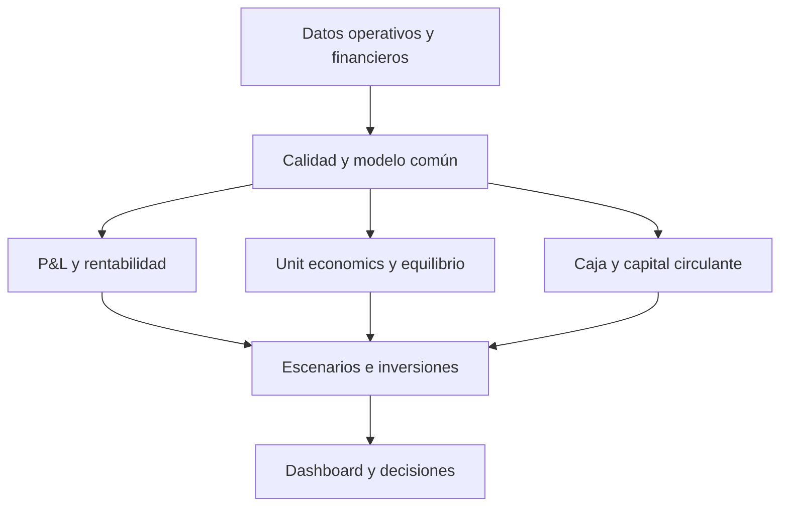

# Levante Ferries — Finanzas Operativas


Proyecto end-to-end de control financiero para una naviera ficticia. Conecta operación, demanda, pricing y estructura de costes con rentabilidad, caja, riesgo e inversión para convertir datos operativos en decisiones de negocio.

> **Nota:** Levante Ferries es una empresa ficticia. Todos los datos son sintéticos y reproducibles; no representan a Baleària ni a ninguna otra compañía real.

## Experiencia interactiva

- [Dashboard financiero publicado](https://www.amlacasta.tech/proyectos/finanzas_operativas/)
- [Portfolio completo](https://www.amlacasta.tech)
- [Simulador financiero de escenarios](outputs/simulators/simulador_financiero_escenarios.html)

## Resumen ejecutivo

| Indicador | Resultado | Lectura de negocio |
|---|---:|---|
| Ingresos acumulados 2024–2026 | **574,1 M€** | Escala suficiente para capturar mejoras operativas relevantes |
| EBITDA acumulado | **39,6 M€** | Crecimiento sostenido, con clara aceleración en 2026 |
| Margen EBITDA acumulado | **6,90 %** | Mejora desde 4,84 % en 2024 hasta 9,92 % en 2026 |
| Flujo de caja libre 2026 | **9,1 M€** | La conversión de resultados en caja mejora de forma material |
| Conversión de caja 2026 | **71,22 %** | Mayor calidad del EBITDA y capacidad de autofinanciación |
| Ruta más rentable | **Dénia–Palma** | 17,59 % de margen y 14,43 M€ de EBITDA |
| Ruta con mayor riesgo | **Barcelona–Ibiza** | Solo 0,07 pp de margen de seguridad sobre el equilibrio |
| Impacto combustible +15 % | **−12,0 M€ EBITDA** | Principal riesgo financiero modelizado |
| Inversión con mayor VAN | **Optimización energética** | VAN de 1,58 M€ e impacto sobre el riesgo dominante |

### Hallazgo central

La rentabilidad global mejora con fuerza, pero está concentrada. Dénia–Palma aporta una parte desproporcionada del margen, mientras Barcelona–Ibiza opera prácticamente en equilibrio. El plan debe combinar protección del coste de combustible, disciplina de capacidad y pricing por ruta, y priorización de inversiones con retorno verificable.

## Preguntas de negocio

1. ¿Qué rutas y buques crean o destruyen margen?
2. ¿Qué explica la desviación frente al presupuesto?
3. ¿Cuánta ocupación necesita cada ruta para cubrir sus costes?
4. ¿Cómo se convierte el EBITDA en caja?
5. ¿Cuál es la exposición ante combustible, demanda y precio?
6. ¿Qué inversiones superan el coste de capital?

## Modelo de datos

| Fuente | Grano | Contenido principal |
|---|---|---|
| `fact_finance_actual.csv` | Mes × ruta × buque | Ingresos, pasajeros, capacidad, millas y costes reales |
| `fact_finance_budget.csv` | Mes × ruta × buque | Presupuesto operativo-financiero comparable |
| `fact_cashflow_monthly.csv` | Mes | EBITDA, capital circulante, CAPEX, impuestos y caja |
| `dim_route.csv` | Ruta | Origen, destino y distancia |
| `dim_vessel.csv` | Buque | Capacidad, antigüedad y características operativas |
| `data_dictionary.csv` | Campo | Definición, tipo y unidad de cada variable |

## Arquitectura analítica



## Estructura del repositorio

```text
Finanzas_operativas/
├── data/
│   ├── raw/                    # Datos sintéticos de entrada
│   └── data_dictionary.csv     # Diccionario de datos
├── notebooks/                 # Flujo analítico reproducible 00–08
├── outputs/
│   ├── tables/                # KPIs, controles y resultados exportados
│   └── simulators/            # Simulador financiero interactivo
├── README.md
└── requirements.txt
```

## Notebooks

| Orden | Notebook | Objetivo |
|---:|---|---|
| 00 | `00_configuracion_y_datos.ipynb` | Configuración, carga y perfilado inicial |
| 01 | `01_calidad_y_modelo_financiero.ipynb` | Calidad, reconciliaciones y modelo analítico |
| 02 | `02_pyg_rentabilidad_global.ipynb` | P&L, evolución anual y rentabilidad consolidada |
| 03 | `03_rentabilidad_rutas_buques.ipynb` | Margen y contribución por ruta y buque |
| 04 | `04_presupuesto_y_desviaciones.ipynb` | Variaciones frente a presupuesto y drivers |
| 05 | `05_unit_economics.ipynb` | RASK, CASK, ocupación de equilibrio y seguridad |
| 06 | `06_caja_y_capital_circulante.ipynb` | Conversión de caja, CAPEX y meses de estrés |
| 07 | `07_escenarios_y_sensibilidad.ipynb` | Sensibilidad a combustible, demanda y precio |
| 08 | `08_inversiones_integracion_y_decision.ipynb` | VAN, TIR, payback y mapa ejecutivo de decisión |

Los notebooks se entregan ejecutados, conservan sus resultados y exportan tablas auditables a `outputs/tables`.

## KPIs

| KPI | Fórmula | Uso |
|---|---|---|
| Margen de contribución | Ingresos − costes variables | Valor incremental de operar |
| EBITDA operativo | Margen de contribución − costes fijos asignados | Rentabilidad de rutas y buques |
| Margen EBITDA | EBITDA / ingresos | Comparación entre segmentos |
| Ocupación | Pasajeros / capacidad | Utilización comercial |
| Ocupación de equilibrio | Coste fijo / contribución a plena capacidad | Mínimo para no destruir valor |
| Margen de seguridad | Ocupación real − ocupación de equilibrio | Colchón operativo |
| RASK marítimo | Ingresos / asiento-milla disponible | Monetización de capacidad |
| CASK marítimo | Coste / asiento-milla disponible | Eficiencia unitaria |
| Flujo de caja libre | Flujo operativo − CAPEX | Capacidad de financiación |
| Conversión de caja | Flujo operativo / EBITDA | Calidad del resultado |
| VAN | Valor presente de flujos − inversión inicial | Creación de valor |
| TIR | Tasa que hace VAN = 0 | Retorno frente al coste de capital |
| Payback | Tiempo hasta recuperar la inversión | Riesgo y liquidez |

## Resultados

### Rentabilidad y caja

| Año | Ingresos | EBITDA | Margen EBITDA | Flujo de caja libre | Conversión de caja |
|---:|---:|---:|---:|---:|---:|
| 2024 | 181,8 M€ | 8,8 M€ | 4,84 % | −0,9 M€ | 46,91 % |
| 2025 | 192,2 M€ | 10,9 M€ | 5,69 % | 1,3 M€ | 55,52 % |
| 2026 | 200,1 M€ | 19,9 M€ | 9,92 % | 9,1 M€ | 71,22 % |

### Rentabilidad por ruta

| Ruta | Margen EBITDA | Margen de seguridad | Diagnóstico |
|---|---:|---:|---|
| Dénia–Palma | 17,59 % | 8,87 pp | Motor principal de rentabilidad |
| Dénia–Formentera | 8,26 % | 4,47 pp | Rentable y resiliente |
| Valencia–Ibiza | 5,56 % | 1,80 pp | Margen ajustado |
| Dénia–Ibiza | 5,52 % | 2,69 pp | Colchón moderado |
| Barcelona–Palma | 4,58 % | 1,08 pp | Requiere disciplina de capacidad |
| Valencia–Palma | 4,58 % | 0,95 pp | Vulnerable a shocks menores |
| Barcelona–Ibiza | 3,08 % | 0,07 pp | Prácticamente en equilibrio |

### Escenarios 2026

| Escenario | EBITDA | Margen | Variación vs. base |
|---|---:|---:|---:|
| Base | 19,85 M€ | 9,92 % | — |
| Combustible +15 % | 7,83 M€ | 3,91 % | −12,02 M€ |
| Demanda −8 % | 15,94 M€ | 8,66 % | −3,92 M€ |
| Precio +3 % | 25,85 M€ | 12,54 % | +6,00 M€ |
| Eficiencia combinada | 31,99 M€ | 15,37 % | +12,14 M€ |

### Evaluación de inversiones

| Iniciativa | CAPEX | VAN | TIR | Payback |
|---|---:|---:|---:|---:|
| Optimización energética de flota | 6,20 M€ | 1,58 M€ | 14,96 % | 4,49 años |
| Electrificación en puerto | 4,80 M€ | 0,97 M€ | 12,87 % | 5,45 años |
| Revenue management avanzado | 1,45 M€ | 0,95 M€ | 31,28 % | 2,38 años |

## Recomendaciones ejecutivas

1. **Proteger el margen frente al combustible.** La sensibilidad de −12,0 M€ justifica coberturas, recargos y eficiencia energética.
2. **Intervenir Barcelona–Ibiza.** Revisar frecuencias, capacidad, mix y pricing; su margen de seguridad es prácticamente nulo.
3. **Escalar prácticas de Dénia–Palma.** Separar el efecto de precio, ocupación, mix y estructura de costes.
4. **Priorizar optimización energética y revenue management.** La primera ataca el principal riesgo; la segunda ofrece la TIR más alta y el payback más corto.
5. **Gestionar caja, no solo EBITDA.** Mantener objetivos explícitos de conversión y alertas sobre circulante y CAPEX.

## Reproducción

```bash
git clone https://github.com/amlacasta/Finanzas_operativas.git
cd Finanzas_operativas
python -m venv .venv
source .venv/bin/activate       # Windows: .venv\Scripts\activate
pip install -r requirements.txt
python -m jupyter nbconvert --execute --to notebook --inplace notebooks/*.ipynb
```

La ejecución debe seguir el orden `00` a `08`. Las salidas quedan registradas en `outputs/tables`, incluido el log de ejecución y la validación integral.

## Stack

- Python, pandas y NumPy para transformación y modelización.
- Matplotlib y Seaborn para visualización analítica.
- NumPy Financial para VAN, TIR y evaluación de inversiones.
- Jupyter para trazabilidad y reproducibilidad.
- Dashboard web dark y simulador HTML para comunicación ejecutiva.

## Limitaciones

- Los datos son sintéticos y demuestran metodología, no describen una compañía real.
- La asignación de costes fijos por ruta es un supuesto de gestión.
- Los escenarios son sensibilidades deterministas, no una simulación probabilística.
- VAN y TIR dependen de la tasa de descuento, vida útil y flujos estimados.

## Integración con el portfolio

**Operaciones → Forecasting → Pricing → People Analytics → Finanzas Operativas**

Este quinto proyecto cierra el sistema de decisión del portfolio: traduce la actividad de las áreas anteriores a margen, caja, riesgo y asignación de capital.

## Autor

**Álvaro Martínez Lacasta**  
Portfolio: [amlacasta.tech](https://www.amlacasta.tech)

